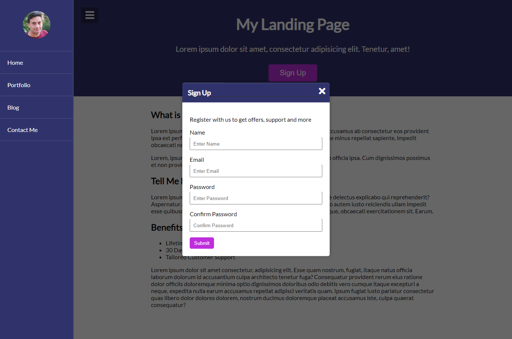

# Udemy--vanillawebprojects-06

**The sixth** of a series of **20 small projects** in **Vanilla JavaScript** from the [**Udemy course**](https://www.udemy.com/course/web-projects-with-vanilla-javascript/) by author [Brad Traversy](https://www.traversymedia.com/) with this [Brad's original GitHub repository](https://github.com/bradtraversy/vanillawebprojects).

# 06: Menu Slider & Modal

Simple landing page with sliding menu and modal

## Project Specifications

- Create and style **landing page**
- Style side **nav** and **modal**
- Add functionality to make **menu open/close** on button click
- Add functionality to make **modal open/close** on button click

## Original preview

    
    
    

## My solution preview

    
    
    

## My solution features

- Custom **UI/UX design**

# Author

Website - [Petr Bednarski](https://github.com/pettik)  
Frontend Mentor - [@pettik](https://www.frontendmentor.io/profile/pettik)
